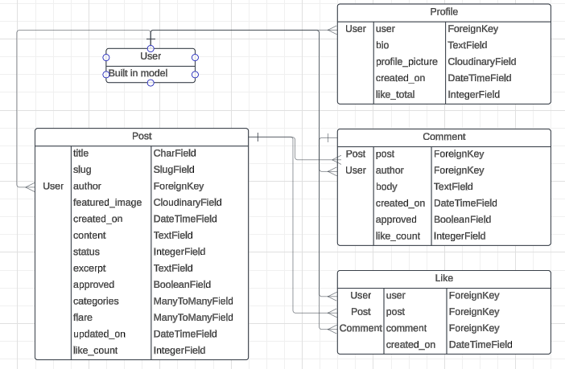
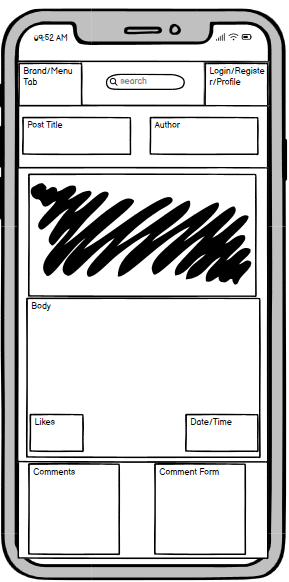

# BOOTCHAMP  

###### THE TRIALS AND TRIBULATIONS OF JR SOFTWARE DEVELOPERS

BOOTCHAMP is a forum for jr software developers to share projects, inspirational stories, cautionary tales, and candid advice. Though BOOTCHAMP reflects UX norms established by social media it takes more after blogs and forums. It took a three week sprint to establish scope, devise and prioritise user stories, and deliver the MVP.   
  
Said MVP is a web application where users can share experiences starting out in software development by way of putting posts to a forum. A user can view a list of posts on the home page, and can click on each post to view more detail. Signed in users can create, edit and delete posts. Signed in users can comment on posts, and edit and delete those comments. Each registered user gets a profile with their post and comment history which they can update, but not delete.  Bootstrap toasts notify users of changes made and Django all-auth handles user registration securely. 

### TECH STACK  

###### LANGUAGES

- HTML - semantic mark up language
- CSS - style the HTML
- JAVASCRIPT - dynamic front end interactions
- PYTHON - back end logic
- SQL - testing models and migrations

###### SERVICES

- [HEROKU](https://www.heroku.com/) - web application hosting
- [NEONDB](https://neon.tech/) - PostgreSQL database 
- [CLOUDINARY](https://console.cloudinary.com/) - image hosting
- [GOOGLEFONTS](https://fonts.google.com/) - Jockey One and Open Sans fonts 
- [FONTAWESOME](https://fontawesome.com/) - icons
 
###### LIBRARIES AND FRAMEWORKS

- [BOOTSTRAP](https://getbootstrap.com/) - A library of CSS class for quick styling
- [DJANGO](https://www.djangoproject.com/) - Python framework for full stack applications
- [DJANGO CRISPY FORMS](https://django-crispy-forms.readthedocs.io/en/latest/) - Bootstrap compatible form layouts
- [WHITENOISE](https://whitenoise.readthedocs.io/en/latest/) - serving static files dynamically
- [ALLAUTH](https://docs.allauth.org/en/latest/) - authorisation and secure site access

###### TOOLS

- GITHUB PROJECTS - information radiators
- [BALSAMIQ](https://balsamiq.com) - creating wireframes
- [LUCIDCHART](https://www.lucidchart.com/pages/?) - creating entity relationship diagrams
- [AMIRESPONSIVE](https://ui.dev/amiresponsive) - creating mockups
- [W3C](https://validator.w3.org/) - validate HTML
- [W3C](https://jigsaw.w3.org/css-validator/) - validate CSS
- [JSLint](https://www.jslint.com/) - Lint Javascript
- [PageSpeed Insights](https://pagespeed.web.dev/) - performance and accessibility review

### DESIGN  

The user stories establish the CRUD functionality of the website. Posts, Comments, Profiles and Likes each have a data model that relates to a built in User model. The entity relationships laid out below includes some features that were not implemented in sprint 1.  

  

BOOTCHAMP was intended to share the familiar layout with contemporary social media.

.png)  

    

###### MUST HAVE USER STORIES  

You can visit the [Project board](https://github.com/users/Sjwilhelms/projects/6) here. 
  
Manually tested and passed

1. as a site user I can view a list of posts so that I can survey the sites content at a glance
1. as a site user I can view each post in detail so that I can engage with the content
1. as a site user I can view the author of each posts profile so that I can see more about them, including their post and commments
1. as a site user I can register an account so that I can have my own profile and contribute to the forum 
1. as a signed in site user I can create, edit, and/or delete a post so that I can contribute to the forum
1. as a signed in site user I can comment on a post and edit/delete said comment so that I can interact with other users
1. as a signed in site user I can update my profile biography
1. as a signed in site user I can get feedback whenever I make a contribution or a change so that I can use the website confidently  

###### SHOULD HAVE USER STORIES  

Not implemented

1. as a site user I can click on an image for full screen so that I can see it in detail
1. as a site user I can scroll through a dynamically paginated 'endless' list of posts so that my load times are kept short
1. as a site user I can search the site from the navbar so I can search as opposed to browse
1. as a signed in site user I can leave a like on a comment or post so that I can interact with other users
1. as a signed in site user I can review/moderate user content so as to filter for inappropriate content
1. as a signed in site user I can categorise posts so that I can engage with a particular theme
1. as a signed in site user I can create categories to assign posts so that I can 

###### THE SECOND ITERATION
  
BOOTCHAMP will have dynamic pagination using AJAX logic; a like button that totals on the recipients profile; full screen viewer for images; and a search bar. 

BOOTCHAMP's test posts dilute the stated goal of the project. Better targeted test users and more semantic forms could correct this.

It will also have another iteration of styling to give the project more flavour and to fully eliminate mobile scrolling from all forms throughout the project. 

### DEPLOYMENT

###### CLONE THE REPOSITORY  

When you clone this repository to a new terminal you will have a couple of things to do before you can start working on an issue. 

In the root menu you will see a file called `requirements.txt`. This contains a list of dependencies which you will need to install to run this project. Run the following command in the terminal window of the same directory to install the contents of that list:

`pip install -r requirements.txt`

In `config/settings.py` you will need to add your own IP's to the `ALLOWED_HOSTS` variable so that you can deploy the project on a local server using your own IDE. Henceforth this file will be referred to as `settings.py`.   

Inside `settings.py` there is a variable `DEBUG`. Whilst you are developing your project you will find it useful to recieve detailed information when you encounter an error by setting `DEBUG = "True"`. For production deployment set `DEBUG = "False"`. 

Create an `env.py` file in the project directory and add this to `.gitignore`. This will keep sensitive information confidential. In env.py `import os` and store `SECRET_KEY`, `CLOUDINARY_URL`, and `DATABASE_URL` variables which will be called in your `settings.py`. Create your own `SECRET_KEY`. Get URL's from your NeonDB and Cloudinary dashboards. 

###### DEPLOY THE PROJECT

Set up account with [CLOUDINARY](https://console.cloudinary.com/)  
- get your URL, and you can review uploaded images on your dashboard

Set up account with [NEONDB](https://neon.tech/)
- get your API key

Open a new repository in [Github](https://github.com/) and open it in preferred IDE. 

Set up accounts and billing with [HEROKU](https://www.heroku.com/)  
- create a new app and link it to github repo
- select region as Europe
- in `Settings`, add `CLOUDINARY_URL`, `DATABASE__URL`, and `SECRET_KEY` to config vars(in your project these variables are confidentially stored in `env.py` file, and called by `settings.py`)
- in `Deploy`, you can select which github branch to deploy from. This can help preserve the main branch whilst troubleshooting.
- in `Deploy`, press the `Deploy Branch` button at the bottom of the page. This will take a moment.

### TESTING

###### MANUAL TESTING

The project has had a raft of manual testing from the developer and from other users. Each user story has been manually tested by users. You will see on BOOTCHAMP that test users have left content. 

###### AUTOMATIC TESTING

The next iteration of BOOTCHAMP will feature automatic testing.

###### VALIDATION

HTML and CSS Validated with [W3Schools](https://validator.w3.org/). All views passed validation except 2 detailed below:  

accounts/signup 

post_detail/

I used [PageSpeed Insights](https://pagespeed.web.dev/) to validate my page for accessibility and performance on mobile and desktop.  
Accessibility and contrast scored well. Areas to review are centered around image hanndling and loading URL's in the head element of the base template. 

Mobile:

  
  
Desktop:  

  

[JSLint](https://www.jslint.com/) was used to lint javascript. It failed on all counts due to not being able to access DOM variables. Manual testing was required. 

### REFERENCES

Project is a variation on the [CodeStar Blog](https://github.com/Sjwilhelms/django-blog) project from the Code Institute LMS and my process reflects that project and the developing with Django section of the LMS.  

The `Comment` model, `comments.js`, are lifted wholesale from CodeStar. 

I used LLM assistants listed below to create user profiles each time a user registrates and logic for implementing toasts. 

I used the following to help me with troubleshooting:

[Mozilla](https://developer.mozilla.org/en-US/docs/Learn)  

[W3Schools](https://www.w3schools.com/)  

[Stack Overflow](https://stackoverflow.com/)  

I used the following to help me with ideation:

[ClaudeAi](https://claude.ai/new)  

[ChatGpt](https://chatgpt.com/)

### REFLECTIONS

Does the world need a social media for jr software developers? Who could say?  

This project has been an excellent learning experience but I can't say this is the finished article. As a learning experience I'm a lot more confident with Django and believe I can cut down the development time significantly and devote more time to style.

###### DESIGN 

The familiar layout works. Overall, without one superuser creating a theme, more work is required to imprint that theme onto the site. I think particularly working with the models and the forms. 

###### CRUD?

I like the way it works and will be adding more features in the new year. I would like to handle images more elegantly, and PageSpeed Insights indicates that I'm mixing HTTP and HTTPS requests. The comments logic is lifted wholesale from Codestar Blog and going forwards I'd like to replace it with my own.

###### STYLE?

Styling was sadly relegated due to precedence of other factors. I prefer a clean interface but not this clean. 

###### RESPONSIVENESS

Am I responsive? Mostly! On mobile there is some overflow scrolling on the registration page, and each of my custom forms. Better for the user to see everything they need at a glance. This would help give more meaning to my forms, helping to guide user input. 

###### SUMMARY

Theres plenty to do. 